# PingPongGAME
AI的PingPing對打
# 系統開發流程 Breakdown (System Development Lifecycle)

本專案採用典型的機器學習閉環系統，從規則驅動的資料採集開始，最終實現 AI 自主決策。以下是各階段的詳細拆解：

---

### 1. 資料蒐集階段 (Rule-based Data Generation)
**核心檔案：** `Rule-based_Data_generation.py`
此階段旨在透過「完美專家規則」為機器學習建立導師數據（Ground Truth）。

* **物理預判邏輯**：
    * 利用球的速度 ($ball\_vx, ball\_vy$) 與目標高度 ($target\_y$)，預測球落到板子高度時的水平落點 $pred\_x$。
    * 處理牆壁反彈的鏡像位移運算，確保預測精確度。
* **決策標註 (Labeling)**：
    * 根據預測落點與板子中心 ($platform\_center$) 的距離，產出標籤：`MOVE_LEFT`、`MOVE_RIGHT` 或 `NONE`。
* **資料持久化**：
    * **對象**：僅記錄 1P 的行為（作為 AI 學習目標）。
    * **存檔**：遊戲重置時，將暫存數據自動寫入 `training_data/game_data_rule_based_*.csv`。

---

### 2. 資料清理與整理階段 (Data Cleaning)
**核心檔案：** `clean_data.py`
將原始 CSV 資料提煉為高品質特徵集，落實「Garbage In, Garbage Out」的品質控制。

* **資料合併與修復**：掃描並合併多份 CSV 檔案，移除空值 (NaN) 並修正欄位格式。
* **特徵對齊 (Alignment)**：
    * 計算水平相對距離 $diff\_x = ball\_x - platform\_x$，讓模型專注於「距離感」。
* **關鍵過濾 (Filtering)**：
    * 僅保留 `ball_vy > 0` (球向下掉) 的時刻，因為此時板子的移動才有實際意義。
* **資料平衡 (Resampling)**：
    * **防止偏差**：遊戲中「靜止 (NONE)」的比例遠高於「移動」，此步驟將 NONE 數量削減至與移動指令 1:1 的比例，避免模型學會「偷懶」不移動。

---

### 3. 模型訓練與評估階段 (Model Training)
**核心檔案：** `train.py`
使用監督式學習訓練 AI 的「大腦」。


* **演算法選擇**：採用 **隨機森林 (Random Forest)**，因其在處理小規模非線性物理規律時具有極高的穩定性。
* **特徵工程 (Feature Selection)**：
    * 精簡輸入維度：僅使用 `diff_x` (相對位移) 與 `ball_vx` (球水平速)。移除高度等雜訊特徵，增加模型泛化能力。
* **效能評估**：
    * 計算 **Accuracy (準確率)**、**Precision (精確率)** 與 **F1-Score**。
* **模型導出**：將訓練完成的模型序列化為 `model.pickle`。

---

### 4. AI 執行階段 (ML Play)
**核心檔案：** `ml_play.py`
將模型部署回遊戲環境，實現即時閉環控制。

* **模型加載**：在 AI 初始化時讀取 `model.pickle`。
* **即時推理 (Real-time Inference)**：
    * 在每一幀更新時，讀取即時遊戲狀態 (`scene_info`)。
    * 提取與訓練時**完全一致**的特徵序列：`[diff_x, ball_vx]`。
* **閉環執行**：將預測結果回傳給遊戲引擎，AI 取代規則演算法，達成自主控球。

---

## 流程總結表

| 階段 | 輸出物 | 關鍵技術 |
| :--- | :--- | :--- |
| **資料蒐集** | 原始 CSV | 物理反彈預測、CSV Logging |
| **資料清理** | 清洗後 CSV | Pandas、資料平衡、特徵工程 |
| **模型訓練** | `model.pickle` | Random Forest、Scikit-learn |
| **AI 執行** | 遊戲控制指令 | Pickle 推理、即時特徵提取 |

---

## 隨機森林模型規格 (Algorithm Specifications)


### 輸入特徵 (Input Features / $X$)
模型專注於最具影響力的物理參數，過濾掉冗餘雜訊：
1.  **diff_x**：板子中心與球的水平相對距離 ($platform\_x - ball\_x$)。
2.  **ball_vx**：球的水平速度。

### 輸出類別 (Output Classes / $y$)
模型輸出對應遊戲引擎的三種離散指令：
* **MOVE_LEFT (1)**：向左移動。
* **MOVE_RIGHT (2)**：向右移動。
* **NONE (0)**：保持靜止。

### 模型Hyperparameters
| 參數 | 設定值 | 目的 |
| :--- | :--- | :--- |
| `n_estimators` | 20 | 確保推理速度與精度的平衡 |
| `max_depth` | 10 | 防止過度擬合並控制模型檔案體積 |
| `random_state` | 42 | 確保模型訓練結果可被復現 |

### 以專案為例
`model = RandomForestClassifier (n_estimators=20, max_depth=10, random_state=42)`

n_estimators=20：

* 定義：這台「森林」裡要有幾棵決策樹。
* 影響：通常樹越多，預測越穩，但運算時間越長。

max_depth=10：

* 定義：每一棵樹最高可以長到幾層。
* 影響：限制深度可以防止模型過度記住訓練數據的細節，有助於泛化到新的遊戲關卡。

random_state=42：

* 定義：隨機種子。
* 影響：確保你每次按下訓練鈕，跑出來的結果都一模一樣，方便除錯。

---
### 如何找到最完美的Hyperparameters？

實務上，工程師不會只猜一個數字，通常會使用以下方法來尋找最佳組合：
* 網格搜尋 (Grid Search)：像點菜清單一樣，列出所有組合（例如樹：10, 20, 50 棵；深度：5, 10, 15 層），讓電腦全部跑一遍，看哪組分數最高。
* 隨機搜尋 (Random Search)：在一個範圍內隨機挑選組合來跑，效率通常比網格搜尋高。
  
---
## 模型評估指標說明 (Evaluation Metrics)

在 `train.py` 中，我們透過以下指標來驗證 AI 的決策品質：

| 指標 | 說明 | 在本遊戲中的意義 |
| :--- | :--- | :--- |
| **Accuracy** | 總準確率 | AI 動作與專家建議完全一致的總比例。 |
| **Precision** | 精確率 | 當 AI 決定移動時，該移動動作是正確的機率（減少誤判）。 |
| **Recall** | 召回率 | 在板子必須移動的時刻，AI 成功做出反應的機率（減少漏判）。 |
| **F1-Score** | 綜合得分 | 精確率與召回率的平衡表現，數值越高代表 AI 控制越穩定。 |

### 為什麼我們需要 Classification Report？
透過 `classification_report`，我們可以分別觀察 `MOVE_LEFT`、`MOVE_RIGHT` 與 `NONE` 三個類別的表現。
* 如果 `NONE` 的得分很高但 `MOVE` 的得分很低，代表模型對於「移動」的特徵掌握不足，可能需要增加更多球移動時的訓練數據。

## 如何執行
1. **蒐集數據**：執行遊戲並載入 `Rule-based_Data_generation.py`。
2. **清理數據**：運行 `python clean_data.py` 生成清理後的 CSV。
3. **訓練模型**：運行 `python train.py` 產出 `model.pickle`。
4. **啟動 AI**：執行遊戲並指定使用 `ml_play.py`。

## 系統架構拆解   

```mermaid
graph TD
    %% 主標題
    Root[AI 打磚塊遊戲系統] --> Collection[1. 資料蒐集階段]
    Root --> Cleaning[2. 資料清理與整理]
    Root --> Training[3. 模型訓練與評估]
    Root --> Execution[4. AI 執行階段]

    %% 第一階段：資料蒐集
    subgraph "Rule-based Data Generation"
    Collection --> RB_Algo[專家規則演算法]
    Collection --> Physics[物理反射預判邏輯]
    Collection --> CSV_Log[儲存原始數據 CSV]
    end

    %% 第二階段：資料清理
    subgraph "Data Preprocessing"
    Cleaning --> Merge[合併多筆遊戲資料]
    Cleaning --> Filter[過濾 ball_vy > 0 數據]
    Cleaning --> Balance[資料平衡 NONE vs MOVE 1:1]
    end

    %% 第三階段：訓練與評估
    subgraph "Machine Learning"
    Training --> RF_Model[Random Forest 模型初始化]
    Training --> Hyper[超參數設定 n_estimators/max_depth]
    Training --> Metrics[評估指標 Accuracy/F1-Score]
    Training --> Export[導出 model.pickle]
    end

    %% 第四階段：執行
    subgraph "ML Inference"
    Execution --> Load[加載 model.pickle]
    Execution --> Feature[即時提取特徵 diff_x/ball_vx]
    Execution --> Predict[模型預測動作輸出]
    Execution --> Action[控制板子移動]
    end

    %% 樣式設定
    style Root fill:#f96,stroke:#333,stroke-width:2px
    style Collection fill:#3498db,color:#fff
    style Cleaning fill:#9b59b6,color:#fff
    style Training fill:#f1c40f,color:#000
    style Execution fill:#2ecc71,color:#fff
```

### 1. 物理反射預判邏輯 (Physics Prediction Logic)

此部分負責計算球的運動軌跡，包含時間預估與邊界反彈處理，以預測球最終落到板子高度的 X 座標 。
```python
# 運作於 update 函數內
if incoming:
    # A. 計算時間 (步驟): 垂直距離 / 垂直速度 
    steps = (target_y - ball_y) / ball_vy
    
    # B. 預測初步落點 X: 起始點 + (水平速度 * 步數) 
    pred_x = ball_x + (ball_vx * steps)
    
    # C. 處理牆壁反彈邏輯 
    bound_left = 0
    bound_right = 200
    while pred_x < bound_left or pred_x > bound_right:
        if pred_x > bound_right:
            # 撞到右牆向左反彈
            pred_x = bound_right - (pred_x - bound_right) [cite: 3]
        elif pred_x < bound_left:
            # 撞到左牆向右反彈
            pred_x = -pred_x [cite: 3]
```
### 2.專家規則演算法 (Expert Rule-based Algorithm)

此部分根據物理預判出的落點 pred_x 與板子當前中心點 platform_center 進行比較，決定具體的行動指令（Command） 。
```python
# 運作於 update 函數內
# D. 定義決策基準 
platform_center = platform_x + 20 # 板子寬度為 40，中心在 +20 
tolerance = 2 # 容許誤差範圍 

# E. 根據相對位置決定指令 
if platform_center < pred_x - tolerance:
    command = "MOVE_RIGHT" # 板子在球落點左側，向右移 
elif platform_center > pred_x + tolerance:
    command = "MOVE_LEFT" # 板子在球落點右側，向左移 
else:
    command = "NONE" # 已對準落點，保持不動
```
### 3. 儲存原始數據 CSV (Data Storage CSV)

此部分包含兩個階段：第一是在遊戲運行中即時將特徵與決策存入記憶體（data_log），第二是在遊戲重置時將其寫入實體 CSV 檔案 。
```python
# 階段 A: 錄製數據 (於 update 函數內)
if self.side == "1P": # 僅錄製 1P 數據 
    if ball_vx != 0 or ball_vy != 0:
        self.data_log.append({
            "ball_x": ball_x, "ball_y": ball_y,
            "ball_vx": ball_vx, "ball_vy": ball_vy,
            "platform_x": platform_x,
            "command": command # 存入專家產出的正確指令 
        })

# 階段 B: 寫入檔案 (於 reset 函數內)
def reset(self):
    if self.side == "1P" and self.data_log:
        file_exists = os.path.isfile(self.file_path)
        with open(self.file_path, 'a', newline='') as f:
            writer = csv.DictWriter(f, fieldnames=self.data_log[0].keys())
            if not file_exists:
                writer.writeheader() # 建立標題列 
            writer.writerows(self.data_log) # 寫入完整教學數據 
        self.data_log = [] # 清空記憶體緩存
```
